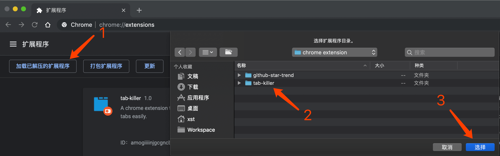

# tab-killer

管理浏览器tab选项卡的一个Chrome插件，当浏览器同时打开很多个tab选项卡时，标题的空间往往会被压缩得很小而难以辨别。点击该插件按钮，会生成一个弹出窗口，按窗口分组，罗列出所有的tab选项卡信息以供浏览，点击时会快速打开选定tab。支持以下特性：

- tab选项卡信息快速浏览/切换
- 根据title/url快速检索筛选
- 关闭选定tab选项卡

## 预览


## 使用

1. 下载项目

```bash
git clone https://github.com/SmallStoneSK/tab-killer.git
```

2. 打开Chrome浏览器，地址栏中输入chrome://extensions/，选择加载已解压的扩展程序，并选择下载好的`tab-killer`目录即可。



3. 快捷键

你可以通过`快捷键`而不是点击图标的方式来启动插件：

|平台|快捷键|
|---|------|
|Windows|`Ctrl`+`Shift`+`A`|
|MacOS|`Command`+`Shift`+`A`|

**PS:**

如果快捷键发生冲突，您可以修改[manifest.json](https://github.com/SmallStoneSK/tab-killer/blob/master/manifest.json#L25)中的`commands`字段值。

## License

[MIT协议](./LICENSE)